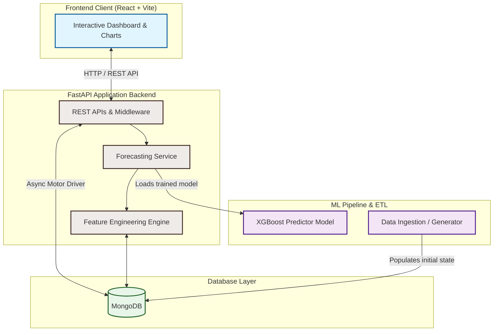

# FarmPriceNepal – AI Fresh Market Price Forecaster

**FarmPriceNepal** is an AI-powered forecasting platform designed for Nepal's fresh produce markets. It empowers smallholder farmers, traders, and agri-fintech partners by providing price transparency and predicting short-term supply shocks.

---

## 🏗️ System Architecture & Workflow

FarmPriceNepal operates on a modern, decoupled three-tier architecture comprising a React frontend, an asynchronous FastAPI backend, a MongoDB database, and an offline machine learning pipeline powered by XGBoost.



### How It Works

1. **Data Ingestion & Seeding**:
   - Historical prices and corresponding weather patterns (temperature, humidity, rainfall) are generated or fetched.
   - The database is populated with markets, commodities, and synthetic/real price entries.

2. **Feature Engineering**:
   - The application computes temporal features (day of week, month, quarter), lag features (1-day, 7-day, 30-day price trends), rolling statistics (7-day and 30-day mean & standard deviation), and localized interaction terms (monsoon index and festival flags).

3. **Model Training**:
   - An **XGBoost Regressor** is trained offline using time-based splitting (80% train, 20% test).
   - Feature weights incorporate weather conditions and Nepal-specific agricultural factors (such as price spikes during the festival season or monsoon supply chain disruptions).
   - The trained model is serialized and stored in the backend model registry.

4. **API and Forecast Inference**:
   - When a user views a crop or market, the frontend queries the FastAPI backend.
   - The forecasting service dynamically builds the inference context, applies feature transformations, and feeds the feature vector to the loaded XGBoost model.
   - The model returns a forecasted price range including confidence intervals (upper/lower bounds).

5. **Client Visualization**:
   - The React UI parses the FastAPI responses and renders beautiful interactive line charts using **Recharts**, depicting historical price trends alongside predicted 7-to-30 day price trajectories and potential supply shock alerts.

---

## 🚀 Hackathon Demo Quick Start

### 1. Backend Setup
1. Open a terminal in `backend/`.
2. Activate the virtual environment:
   ```powershell
   .\venv\Scripts\activate
   ```
3. Install dependencies:
   ```bash
   pip install -r requirements.txt
   ```
4. Generate synthetic market data (2 years of historical prices):
   ```bash
   python etl/generate_synthetic.py
   ```
5. Seed MongoDB:
   *Ensure MongoDB is running (locally or via Docker).*
   ```bash
   # Run the server which initializes indexes, or use a script to seed
   uvicorn app.main:app --reload
   ```

### 2. ML Model Training
1. Open `backend/app/ml/train_model.ipynb` in VS Code or Jupyter.
2. Run all cells to train the **XGBoost Regressor** on the generated data.
3. This will save `primary_price_model.pkl` to `backend/app/ml/models/`.

### 3. Frontend Setup
1. Open a terminal in `frontend/`.
2. Install dependencies:
   ```bash
   npm install
   ```
3. Start the dev server:
   ```bash
   npm run dev
   ```
4. Open [http://localhost:5173](http://localhost:5173).

---

## 🛠 Tech Stack
- **Backend**: FastAPI (Async), Motor (MongoDB driver), Pydantic v2.
- **ML Pipeline**: XGBoost, Scikit-learn, Pandas, Recharts (frontend visualization).
- **Database**: MongoDB.
- **Frontend**: React 18, Vite, Recharts, CSS Modules.
- **DevOps**: Docker & Docker Compose.

---

## ✨ Key Features
1. **AI Price Forecasting**: 7-30 day horizons with confidence intervals.
2. **Supply Shock Alerts**: Automated detection of price spikes/drops (monsoon, festivals).
3. **Fintech Integration**: Loan recommendations and insurance trigger signals.
4. **Market Arbitrage**: District-wise price comparison.
5. **Interactive Analytics**: Heatmaps and volatility indices.

---

## 📊 Data Insights (Nepal Context)
- **Monsoon Logic**: Veggie prices increase by 15-25% during Jun-Sep due to supply chain disruptions.
- **Festival Spikes**: Dashain and Tihar see 20% price bumps for staples and fruits.
- **Regional Multipliers**: Prices are indexed against Kalimati with district-wise adjustments.

---

## 🧪 Testing
Run backend tests using:
```bash
pytest backend/tests/
```
